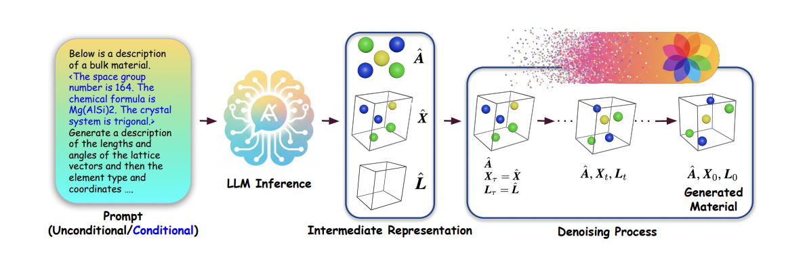

# LLM Meets Diffusion: A Hybrid Framework for Crystal Material Generation. (NeurIPS 2025)

[](https://arxiv.org/pdf/2510.23040)
[](https://github.com/kdmsit/crysllmgen/)


This repository contains the official code release for our ICLR 2025 paper [*"LLM Meets Diffusion - A Hybrid Framework for Crystal Material Generation"*](https://arxiv.org/pdf/2510.23040), 
by [Subhojyoti Khastagir*](https://www.linkedin.com/in/subhojyoti-khastagir-2a4716152/), [Kishalay Das*](https://kdmsit.github.io/), [Pawan Goyal](https://cse.iitkgp.ac.in/~pawang/), Seung-Cheol Lee, [Satadeep Bhattacharjee](linkedin.com/in/satadeep-bhattacharjee-545567114/), [Niloy Ganguly](https://niloy-ganguly.github.io/).


CrysLLMGen introduces a hybrid approach to generating 3D  structure of crystal materials. Key contributions of CrysLLMGen are:
- Hybrid LLM + Diffusion Framework: Integrates LLMs for discrete predictions with equivariant diffusion models for continuous structural refinement.
- Two-Stage Generation: LLM proposes atom types, coordinates, and lattice; diffusion model refines them for stability and physical validity.
- Constraint-Aware Design: Supports conditional generation based on user-defined composition, space group, and natural-language prompts.
- Balanced Validity & Novelty: Achieves superior stability, structural correctness, and compositional validity compared to standalone LLMs or diffusion models.
- Architecture-Agnostic: Framework can seamlessly incorporate future LLMs and denoising architectures.




## Installation
The list of dependencies is provided in the `requirements.txt` file, generated using `pipreqs`. You can install through the following commands:
```bash
pip install -r requirements.txt
```
However, there may be some ad-hoc dependencies that were not captured. 
If you encounter any missing packages, feel free to install them manually using `pip install`.

## Usage

### Train CrysLLMGen

#### Step-1: Fine-tune LLaMa-2 Model

For Perov-5
```bash
    python -W ignore llm_finetune.py --run-name 7b-perov --model 7b --num-epochs 1 --data-path data/perov_5
```

For MP-20
```bash
    python -W ignore llm_finetune.py --run-name 7b-mp --model 7b --num-epochs 1 --data-path data/mp_20
```

* The fine-tuned model will be saved at: `exp/7b-perov/` or `exp/7b-mp/`

#### Step-2: Train Diffusion Model

For Perov-5
```bash
    python -W ignore diff_train.py --dataset perov_5 --batch_size 512 --epochs 500 --timesteps 1000 --run-type 'train'
```

For MP-20
```bash
    python -W ignore diff_train.py --dataset mp_20 --batch_size 512 --epochs 500 --timesteps 1000 --run-type 'train'
```


* The trained model will be saved at: `out/<Dataset>/<expt_date>/<expt_time>/`, where <Dataset> is 'perov_5' or 'mp_20'

### Unconditional Sampling from CrysLLMGen

#### Step-1: Generate Initial Samples from LLaMa-2 Model

For Perov-5
```bash
    python -W ignore llm_sample.py --model_name 7b --model_path=exp/7b-perov/checkpoint-11356 --num_samples 10000 --dataset perov --temperature 1.0 --top_p 0.7
```

For MP-20
```bash
    python -W ignore llm_sample.py --model_name 7b --model_path=exp/7b-mp/checkpoint-27136 --num_samples 10000 --dataset mp --temperature 1.0 --top_p 0.7
```

* Generated samples will be saved as `.pt` files, such as `llm_sample_mp_10000.pt` or `llm_sample_perov_10000.pt`
* You can try out different --temperature and --top_p values, for different quality of generation.

#### Step-2: Refinement Using Diffusion Model

For Perov-5
```bash
    python -W ignore diff_refinement.py --model_path 'gen/' --chkpt_name <Saved Model Path> --llm_file_name llm_sample_perov_10000.pt  --tasks gen --dataset perov_5 --batch_size 1024 --timesteps 1000 --diff_steps 800  --run-type 'sample'
```

For MP-20
```bash
    python -W ignore diff_refinement.py --model_path 'gen/' --chkpt_name <Saved Model Path> --llm_file_name llm_sample_mp_10000.pt  --tasks gen --dataset mp_20 --batch_size 1024 --timesteps 1000 --diff_steps 700  --run-type 'sample'
```

  * `<Saved Model Path>`: directory where the diffusion model is stored → `out/<Dataset>/<expt_date>/<expt_time>/`
  * `diff_steps`: We use `700` for Perov and `800` for MP. 
  * Generated samples will be saved as `.pt` files in gen/<Dataset> directory, such as `gen/perov_5/eval_gen.pt` or `gen/mp_20/eval_gen.pt`


### Evaluate CrysLLMGen for Unconditional Generation

For Perov-5
```bash
    python -W ignore compute_metrics.py --root_path gen/perov_5/eval_gen.pt --tasks gen --eval_model_name perovskite --gt_file data/perov_5/test.csv
```

For MP-20
```bash
    python -W ignore compute_metrics.py --root_path gen/mp_20/eval_gen.pt --tasks gen --eval_model_name mp20 --gt_file data/mp_20/test.csv
```

For any further query, feel free to contact [Kishalay Das](kishalaydas@kgpian.iitkgp.ac.in)

## How to cite

If you are using CrysLLMGen or our Textual Dataset, please cite our work as follows:

```
@article{khastagir2025llm,
  title={LLM Meets Diffusion: A Hybrid Framework for Crystal Material Generation},
  author={Khastagir, Subhojyoti and Das, Kishalay and Goyal, Pawan and Lee, Seung-Cheol and Bhattacharjee, Satadeep and Ganguly, Niloy},
  journal={arXiv preprint arXiv:2510.23040},
  year={2025}
}
```
